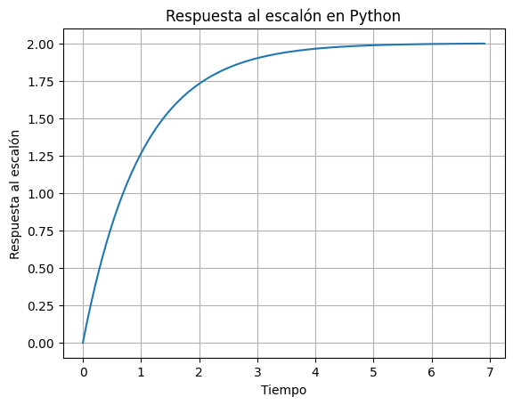
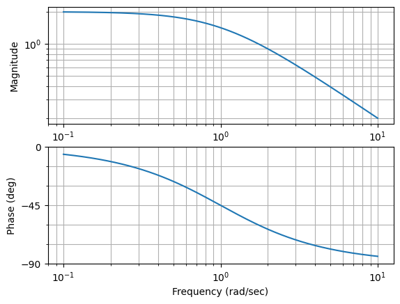
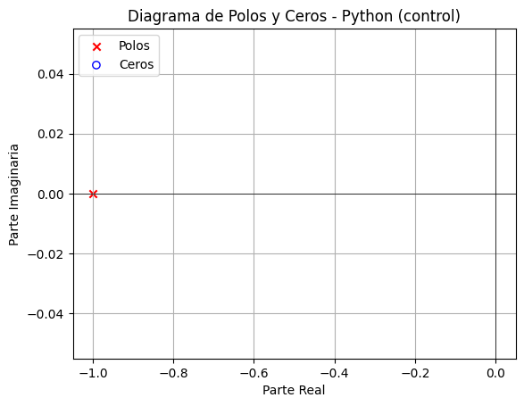

# Sistemas de Primer Orden
## Definición
La función de transferencia de un sistema de primer orden se puede expresar como:

$G(s) = \frac{K}{\tau s + 1}$

Donde:
- $K$ es la ganancia del sistema.
- $\tau$ es la constante de tiempo.

|                          | Python (control)                                    | MATLAB               |
|--------------------------|-----------------------------------------------------|----------------------|
| **Crear Sistema**        | `G = ctrl.TransferFunction([1], [tau, 1])`         | `G = tf(1, [tau, 1])`|
| **Mostrar Func. Transferencia** | `print(G)`                                      | `disp(G)`            |

Codigo en Python
```python
import control as ctrl
import matplotlib.pyplot as plt

# Parámetros del sistema de primer orden
tau = 1.0  # constante de tiempo
K = 2.0    # ganancia

# Crear la función de transferencia en Python usando control
sistema_python = ctrl.TransferFunction([K], [tau, 1])

# Mostrar la función de transferencia
print("Función de transferencia en Python:")
print(sistema_python)
```

Codigo en Matlab
```matlab
% Parámetros del sistema de primer orden
tau = 1.0;  % constante de tiempo
K = 2.0;    % ganancia

% Crear la función de transferencia en MATLAB
sistema_matlab = tf([K], [tau, 1]);

% Mostrar la función de transferencia en MATLAB
disp('Función de transferencia en MATLAB:')
disp(sistema_matlab)
```

## Respuesta a Entrada Paso
|                          | Python (control)                                    | MATLAB               |
|--------------------------|-----------------------------------------------------|----------------------|
| **Respuesta al Escalón** | `time, response = ctrl.step_response(G)`           | `step(G)`            |
| **Graficar Respuesta**   | `plt.plot(time, response)`                         | - |

Codigo en Python
```python
# Graficar la respuesta al escalón en Python
time, response = ctrl.step_response(sistema_python)
plt.plot(time, response)
plt.title('Respuesta al escalón en Python')
plt.xlabel('Tiempo')
plt.ylabel('Respuesta al escalón')
plt.grid(True)
plt.show()
```

Codigo en Matlab
```matlab
% Graficar la respuesta al escalón en MATLAB
figure;
step(sistema_matlab);
title('Respuesta al escalón en MATLAB');
```


## Diagrama de Bode
|                          | Python (control)                                    | MATLAB               |
|--------------------------|-----------------------------------------------------|----------------------|
| **Calcular Respuesta en Frecuencia** | `frecuencia, magnitud, fase = ctrl.bode(sistema_python)` | `[magnitud, fase, frecuencia] = bode(sistema_matlab);` |
| **Graficar Diagrama de Bode** | ```plt.semilogx(frecuencia, magnitud)```<br>```plt.semilogx(frecuencia, fase)``` | ```semilogx(frecuencia, 20*log10(magnitud))```<br>```semilogx(frecuencia, fase)``` |

Codigo en Python
```python
# Calcular la respuesta en frecuencia
frecuencia, magnitud, fase = ctrl.bode(sistema_python)
# Graficar el diagrama de Bode
plt.figure()
plt.subplot(2, 1, 1)
plt.semilogx(frecuencia, magnitud)
plt.title('Diagrama de Bode - Magnitud')
plt.subplot(2, 1, 2)
plt.semilogx(frecuencia, fase)
plt.title('Diagrama de Bode - Fase')
plt.xlabel('Frecuencia (Hz)')
plt.show()
```

Codigo en Matlab
```matlab
% Calcular la respuesta en frecuencia
[magnitud, fase, frecuencia] = bode(sistema_matlab);
% Graficar el diagrama de Bode
figure;
subplot(2, 1, 1)
semilogx(frecuencia, 20*log10(magnitud))
title('Diagrama de Bode - Magnitud')
subplot(2, 1, 2)
semilogx(frecuencia, fase)
title('Diagrama de Bode - Fase')
xlabel('Frecuencia (Hz)')
```


## Diagrama de Polos y Ceros
|                          | Python (control)                                    | MATLAB               |
|--------------------------|-----------------------------------------------------|----------------------|
| **Obtener Polos/Ceros**| `polos, ceros = ctrl.pzmap(sistema, plot=False)`             | `polos = pole(sistema); ceros = zero(sistema);` |
| **Graficar Diagrama**  | ```python plt.scatter(np.real(polos), np.imag(polos), ...``` | ```matlab figure pzmap(sistema) title('Diagrama de Polos y Ceros - MATLAB')``` |

Codigo en Python
```python
# Obtener polos y ceros
polos, ceros = ctrl.pzmap(sistema, plot=False)

# Graficar el diagrama de polos y ceros
plt.scatter(np.real(polos), np.imag(polos), marker='x', color='red', label='Polos')
plt.scatter(np.real(ceros), np.imag(ceros), marker='o', facecolors='none', edgecolors='blue', label='Ceros')
plt.axhline(0, color='black', linewidth=0.5)
plt.axvline(0, color='black', linewidth=0.5)
plt.title('Diagrama de Polos y Ceros - Python (control)')
plt.xlabel('Parte Real')
plt.ylabel('Parte Imaginaria')
plt.legend()
plt.grid(True)
plt.show()
```

Codigo en Matlab
```matlab
% Obtener polos y ceros
polos = pole(sistema);
ceros = zero(sistema);

% Graficar el diagrama de polos y ceros
figure
pzmap(sistema)
title('Diagrama de Polos y Ceros - MATLAB')
```


[Preguntas a ChatGPT](ChatGPT.md)
